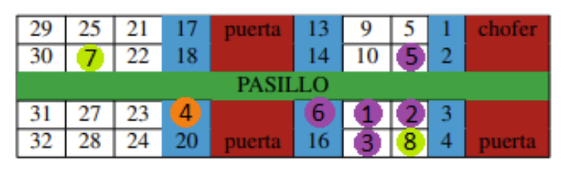

# Optimizing Bus Seats and Entry Order

## Description
Developed in 2022, "Optimizing Bus Seats and Entry Order" is a university project made during the second course of Computer Engineering at UC3M in collaboration with @AliciaBR02.

It was made for the subject "Heuristics and Optimization" and is the solution to a problem proposed. The main goal of this project was to put in practice our knowledge about **Constraints** and **Heuristic Search** to solve optimization problems. Although it is independent, the theme of this project is a continuation of [this one](https://github.com/molinalg/Optimal-Route-Assignment).

## Table of Contents
- [Installation](#installation)
- [Usage (Part 1)](#usage-part-1)
- [Usage (Part 2)](#usage-part-2)
- [Problem Proposed  (Part 1)](#problem-proposed-part-1)
- [Problem Proposed  (Part 2)](#problem-proposed-part-2)
- [License](#license)
- [Contact](#contact)

## Installation
To install the necessary library for this project use the following command:
```sh
pip install python-constraint
```

## Usage (Part 1)
To execute the program, first get into the folder of the code you want to run. Then, use the following command:
```sh
python3 CSPCargaBUS.py CSP-tests/alumnos1
```
**NOTE:** The file "alumnos1" can be changed by another test case in the same folder. The result will be written in an output text file in the same folder.

## Usage (Part 2)
To execute the program, first get into the folder of the code you want to run. Then, use the following command:
```sh
python3 ASTARColaBus.py ASTAR-tests/alumnos1.prob 1
```
**NOTE:** The file "alumnos1" can be changed by another test case in the same folder. The result will be written in 2 output text files in the same folder. The second parameter is the heuristic used in the algorithm. There are 2 available.

## Problem Proposed (Part 1)
The first part of the project consists on assigning seats to a number of students in a bus. This bus has 32 seats, 20 normal seats and 12 reduced mobility seats. The goal of this exercise is, after receiving a file with the students and their data, **to find a way to place them respecting the following rules**:

- Every student must have an assigned seat.

- Reduced mobility students must be seated in a reduced mobility seat and with no other student next to him.

- If a set of reduced mobility seats is empty, a regular student can be assigned those seats.

- Conflictive students can't be seated close to each other or to a reduced mobility student.

- First year students must be seated at the front of the bus and second year students at the back.

- Students who are brothers must seat together unless one of them is a reduced mobility student. If they are from different years, they will seat at the front part of the bus with the younger brother in the window seat.

Below, there is an example of a solution to a set of 8 students:



Each circle represents a student. Purple circles are regular students, the orange one is a reduced mobility student and the green ones are conflictive students.

**In the test files, each student is represented as a set of 5 characters separated by commas.** These characters represent the id of the student, the year they are in (1 or 2), if it is conflictive or not (C or X), if it is of reduced mobility or not (R or X) and, if he has a brother, his id (if not the number will be a 0).

## Problem Proposed (Part 2)
The second exercise asks **to find the best order in which students can get in the bus** using the algorithm A* in python. The criteria to decide which is the best way will be minimizing the cost according to these rules:

- A reduced mobility student has a cost of 3. 

- A regular student helping a reduced mobility student has a cost of 0.

- If a student goes after a conflictive student, his cost duplicates.

- If the seat of a student has a higher number than the one of a conflictive student, his cost duplicates as well.

## License
This project is licensed under the **MIT License**. This means you are free to use, modify, and distribute the software, but you must include the original license and copyright notice in any copies or substantial portions of the software.

## Contact
If necessary, contact the owner of this repository.
